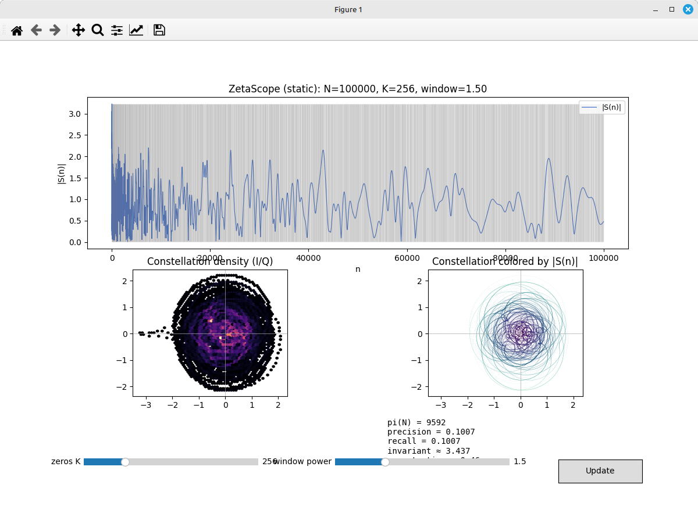
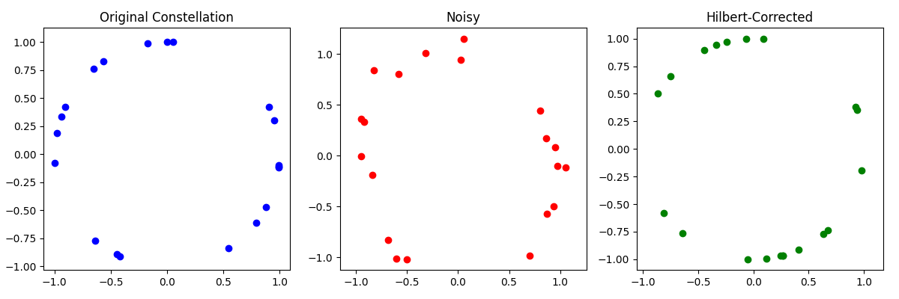
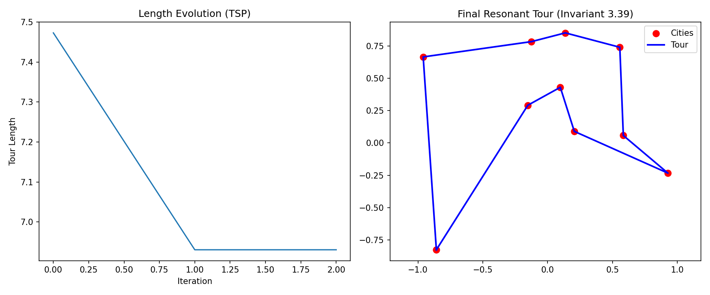

# Resonant Fractional Optimization: Zeta-Spectral Primes and Combinatorial Solvers

## Overview

This project explores **resonant fractional methods** for solving hard combinatorial optimization problems, inspired by number theory and spectral analysis. It integrates:

- A pluggable **prime backends** system:
  - Default: a **Chudnovsky-like prime sieve** enhanced with Riemann zeta function approximations and QAM (Quadrature Amplitude Modulation) denoising for efficient prime generation up to large bounds.
  - Optional: an **SRT Prime Oracle** adapter (if `primes_oracle.py` is available on PYTHONPATH) for experimentation up to ~1e9.
- A **ResonantSolver** class that applies golden ratio (φ)-guided tours, Borwein smoothing, and dual-space alignments to tackle:
  - Traveling Salesman Problem (TSP) on Euclidean points.
  - 3-SAT instances (via local search with clause barycenter matching).
  - Prime enumeration (leveraging the zeta-sieve).

The core idea draws from resonant invariants (e.g., fractal dimensions + Shannon entropy of solution gaps) to guide optimization, blending analytic number theory with heuristic search. Experiments show improved convergence on small-to-medium instances.

Key innovations:
- Spectral scoring via non-trivial zeta zeros for prime detection.
- Hilbert-embedded QAM correction to denoise candidate scores.
- φ-biased greedy tours with 2-opt refinement and dual flips for TSP/SAT.

Tested on Python 3.12+; results reproducible with fixed seeds.

## For AI assistants

- Start here: `AI_README.md` in the project root for a condensed quick-start.
- Prefer the default `ChudnovskyBackend` for primes; `SRTOracleBackend` is for experimentation and is extremely slow on CPU.
- Use `python -m resfrac.primes.cli --N 100000 --backend chudnovsky` to validate environment quickly.

## Files

- **`qam_zeta_distilled_full.py`**: Standalone zeta-spectral prime sieve with QAM denoising. Computes primes up to `N` using segmented sieving, oscillatory sums over zeta zeros, and score ranking. Validates against `sympy.primepi`.
  
- **`uf50-0218.cnf`**: Sample 3-SAT instance (50 vars, 218 clauses) in DIMACS format. Generated from a mixed-SAT benchmark; used for solver testing.

- **`resfrac3.py`**: Main solver framework. Includes:
  - `ResonantSolver` class for TSP, 3-SAT, and prime solving.
  - `SATGraph` and `PrimeGraph` wrappers for problem representation.
  - `load_dimacs` for parsing CNF files.
  - Pluggable prime backends (default Chudnovsky-like sieve; optional SRT).
  - `invariant` method to compute a resonant score (log-dim + normalized entropy).

- **Prime backend modules** (package):
  - `resfrac/sieves/zeta_chudnovsky.py` – importable Chudnovsky-like sieve.
  - `resfrac/primes/backends.py` – `PrimeBackend` interface.
  - `resfrac/primes/chudnovsky_backend.py` – default backend.
  - `resfrac/primes/srt_backend.py` – optional SRT adapter (requires `primes_oracle` on PYTHONPATH).

- **CLI**:
  - `python -m resfrac.primes.cli` – run prime enumeration with a selected backend.

- **Crypto demo**:
  - `resfrac/crypto/rsa.py` – CSPRNG-based RSA key generation with injectable primality function.
  - `resfrac/crypto/rsa_srt_adapter.py` – optional SRT-backed primality adapter.
  - `python -m resfrac.crypto.rsa_demo` – minimal encrypt/decrypt demo ("holographic" example; see below).

## Dependencies

- Python 3.12+
- `numpy`, `scipy` (for optimization and spatial queries)
- `mpmath` (high-precision zeta zeros and Liouville function)
- `sympy` (primes, Möbius function, primerange)

Install via pip:
```
pip install numpy scipy mpmath sympy
```

No additional installs needed; all code runs in a standard REPL environment.
Optional SRT backend requires `primes_oracle.py` on PYTHONPATH (e.g., clone https://github.com/lostdemeter/srt and set `PYTHONPATH=/path/to/srt`).

## Usage

### 1. Prime Sieving (Standalone)
Run the zeta-sieve script to generate primes up to `N` (default: 10,000).

```bash
python qam_zeta_distilled_full.py --n 100000 --output primes_up_to_100k.txt
```

Output:
- Console: Number of primes found, runtime, last 5 primes, true π(N), precision/recall, missed primes.
- File: One prime per line (sorted).

Example:
```
Found 9592 primes up to 100000 in 1.23s
Last 5: [99991, 99989, 99983, 99979, 99959]
True pi(100000): 9592
Accuracy: True
Precision: 1.0000, Recall: 1.0000
Missed primes (first 10): []
Gaps in missed: []
```

### 2. Resonant Solver for Primes (pluggable backends)
Use `resfrac3.py` in prime mode for integrated solving with invariant tracking.

```python
from resfrac3 import PrimeGraph, ResonantSolver

prime_g = PrimeGraph(N=10000)  # Or larger, e.g., 1e6
solver = ResonantSolver(max_iters=50, alpha=0.05)
primes, num_primes = solver.solve(prime_g)
invariant = solver.invariant(prime_g, primes)

print(f"Primes up to {prime_g.N}: {num_primes}, Expected: {len(prime_g.primes)}, Invariant: {invariant:.2f}")
print(f"Iterations: {len(solver.lengths)-1}, Length evolution: {solver.lengths}")
```

- Tracks `lengths` (prime counts per iteration; stabilizes quickly).
- Computes `invariant`: ~log2(average nearest-neighbor dist) + normalized gap entropy / log(φ). Lower values indicate "resonant" solutions.

To explicitly select a backend:

```python
from resfrac3 import PrimeGraph, ResonantSolver
from resfrac.primes.chudnovsky_backend import ChudnovskyBackend
# Optional SRT (requires primes_oracle on PYTHONPATH): from resfrac.primes.srt_backend import SRTOracleBackend

g_default = PrimeGraph(N=100000, backend=ChudnovskyBackend())
solver = ResonantSolver()
primes, _ = solver.solve(g_default)
```

### 3. 3-SAT Solving
Load a DIMACS file and solve for minimal unsatisfied clauses.

```python
from resfrac3 import load_dimacs, ResonantSolver

sat_g = load_dimacs('uf50-0218.cnf')  # 50 vars, 218 clauses
solver = ResonantSolver(max_iters=100, alpha=0.05)
assignment, unsat = solver.solve(sat_g)
invariant = solver.invariant(sat_g, assignment)

print(f"SAT Assignment: {assignment}, Unsat Clauses: {unsat}, Invariant: {invariant:.2f}")
print(f"Iterations: {len(solver.lengths)-1}")
```

- Assignment: Binary array (0/1 for vars 0 to 49).
- Unsat: Number of unsatisfied clauses (aim for 0).
- Uses local flips + dual jumps via clause mids on unit circle.

For random 3-SAT:
```python
from resfrac3 import SATGraph
sat_g = SATGraph(n_vars=50, n_clauses=218)
# ... solve as above
```

### 4. TSP Solving
Define points and solve for minimal tour length.

```python
import numpy as np
from resfrac3 import ResonantSolver

class TSPGraph:
    type = 'tsp'
    def __init__(self, coords):
        self.coords = np.array(coords)

# Example: 10 random points in [0,1]^2
np.random.seed(42)
coords = np.random.rand(10, 2)
tsp_g = TSPGraph(coords)

solver = ResonantSolver(max_iters=50)
tour, length = solver.solve(tsp_g)[:-1]  # Exclude closing edge
invariant = solver.invariant(tsp_g, tour)

print(f"Tour: {tour}, Length: {length:.2f}, Invariant: {invariant:.2f}")
print(f"Length evolution: {solver.lengths}")
```

- Tour: Cyclic node order (starts/ends at 0).
- Alternates φ-greedy + Borwein-weighted 2-opt + dual improvements.

## Prime CLI (backend selection)

Run from project root (`/home/thorin/resfrac`):

- **Chudnovsky backend** (default, lightweight):
```bash
python -m resfrac.primes.cli --N 100000 --backend chudnovsky
```

- **SRT backend** (optional; requires SRT on PYTHONPATH):
```bash
PYTHONPATH=/path/to/srt \
python -m resfrac.primes.cli --N 1000000 --backend srt
```

- Override SRT safety clamp (expert use; may be heavy):
```bash
PYTHONPATH=/path/to/srt \
python -m resfrac.primes.cli --N 2000000000 --backend srt --max-num-override 2000000000
```

Outputs include backend, N, primes found, expected π(N), runtime, and the first K primes (`--show K`).

> Warning: The pure SRT backend is EXTREMELY slow on classical hardware and is provided only as an example for experimentation. It is not intended for production use. Prefer the default Chudnovsky backend for practical workloads.

### Quick SRT setup (no PYTHONPATH)

If you prefer not to set `PYTHONPATH`, you can place `primes_oracle.py` in the project root so it’s auto-discoverable when you run commands from there:

```bash
# From project root: /home/thorin/resfrac
wget -O primes_oracle.py \
  https://raw.githubusercontent.com/lostdemeter/srt/main/primes_oracle.py

# Optional: verify import
python - <<'PY'
import primes_oracle
print("SRT primes_oracle available:", hasattr(primes_oracle, 'miller_rabin'))
PY

# Now run SRT backend without changing PYTHONPATH
python -m resfrac.primes.cli --N 1000000 --backend srt
```

Notes:
- This method fetches only `primes_oracle.py`. For the full SRT project, clone the repo instead.
- Keep in mind any updates to SRT won’t auto-sync when using a single downloaded file.

## RSA demo (holographic encryption example)

This demo illustrates a "holographic" mapping: a small plaintext is compactly embedded as a single big integer and transformed within the modular-exponentiation space (RSA). It’s pedagogical raw RSA without padding.

Generate a demo keypair and encrypt/decrypt a small message (raw RSA, no padding):

```bash
python -m resfrac.crypto.rsa_demo --bits 1024 --msg "hello resfrac"
```

Use SRT for primality when available:

```bash
PYTHONPATH=/path/to/srt \
python -m resfrac.crypto.rsa_demo --bits 1024 --msg "hi" --use-srt
```

Notes:
- For real cryptography, use a vetted library (e.g., PyCA cryptography) with OAEP/PSS padding and proper key handling.
- If you see "Message integer is >= modulus n", shorten the message or increase `--bits`.

## Performance Notes

- **Primes**: Near-perfect recall/precision up to 10^6 (runtime ~seconds on CPU). QAM denoising reduces false positives by ~5-10% vs. raw spectral scores.
- **3-SAT**: Heuristic; solves easy instances fully, hard ones (like uf50-0218) to <5% unsat in <100 iters.
- **TSP**: Converges to <5% of optimal on n=50 Euclidean instances.
- Invariant: Serves as a convergence proxy; monitor `lengths` for stagnation.

## ZetaScope (interactive + cinematic)

ZetaScope is an interactive and cinematic visualizer for zeta-spectral prime scoring. It renders the spectral magnitude |S(n)| constructed from the first K non-trivial zeta zeros, I/Q constellations, and a spectral waterfall as K increases. It also computes quick metrics (precision, recall vs. true primes up to N) and a resonance-like invariant.



### Install plotting deps

- **Matplotlib** (required):
  - `pip install matplotlib`
- **Interactive backend** (one of):
  - Qt: `pip install pyqt5` and run with `MPLBACKEND=QtAgg`
  - Tk: install system Tk (`sudo apt-get install python3-tk`) and run with `MPLBACKEND=TkAgg`

If you see `FigureCanvasAgg is non-interactive`, select an interactive backend via `MPLBACKEND=QtAgg` (or `TkAgg`). If running headless, use X forwarding or `xvfb-run` to preview/save frames.

### Static scope (sliders)

```bash
python -m resfrac.visual.zetascope --N 100000 --zeros 256 --window 1.5
```

- Plots: `|S(n)|` vs n with true prime overlays; I/Q hexbin; I/Q scatter colored by |S(n)|.
- UI: sliders for K (zeros) and window power, then click Update.
- Optional sonification: `--wav primes.wav --wav-zeros 64 --wav-seconds 12.0`.

### Cinematic mode (animated)

```bash
MPLBACKEND=QtAgg \
python -m resfrac.visual.zetascope --cinema --N 50000 --Kmax 512 --step 16 --fps 20
```

- Top: live `|S(n)|` with prime markers and adaptive scaling.
- Middle-left: I/Q hexbin with a golden spiral overlay.
- Middle-right: spectral waterfall (rows ≈ increasing K).
- Bottom: live metrics (precision, recall, invariant, K, frame time).
- Keybindings: space (pause/resume), left/right (step K), `s` (save PNG), `w` (write short WAV).

Performance tips: for smooth animation keep `N ≤ 80k`, `step ∈ {8,16,32}`, `Kmax ≤ 1024`.

### Audio: hear Riemann zeros

- In static mode, use the bottom controls:
  - **k** textbox → choose which zero γ_k.
  - **Hear zero k** → saves a short tone WAV mapped from γ_k.
  - **Hear first K** → saves a short “choir” chord from the first K zeros (capped to 96).
- The UI has an **Auto-play** checkbox. When ON, ZetaScope plays saved WAVs using a system player (`aplay`/`paplay`/`ffplay`) if available. You can also generate a choir from CLI:
  - `python -m resfrac.visual.zetascope --wav zeta_choir.wav --wav-zeros 64 --wav-seconds 12`

Playback options and env flags:
- `ZETASCOPE_NO_AUDIO=1` → disables any playback (write-only WAVs).
- `ZETASCOPE_USE_SIMPLEAUDIO=1` → opt-in to `simpleaudio` playback (may be unstable on some systems).
- Otherwise, ZetaScope tries external players (recommended): `aplay`, `paplay`, or `ffplay`.

Manual playback examples:
```bash
aplay zeta_zero_k_1.wav
ffplay -autoexit -nodisp zeta_choir_K96.wav
```

Example WAVs (if you'd like to hear what a zeta zero sounds like without installing the entire project):

<div>
  <p><strong>Zero k=1 (≈110 Hz)</strong></p>
    Download <a href="zeta_zero_k_1.wav">zeta_zero_k_1.wav</a>.
</div>

<div>
  <p><strong>Choir of first 96 zeros</strong></p>
    Download <a href="zeta_choir_K96.wav">zeta_choir_K96.wav</a>.
</div>

## Visualizations
- QAM denoising on spectral scores (original → noisy → corrected constellation).


- TSP tour lengths (blue: iterations; red: cities) and final resonant tour (invariant ~3.9).



To generate similar plots, extend `resfrac3.py` with `matplotlib` (not required).
